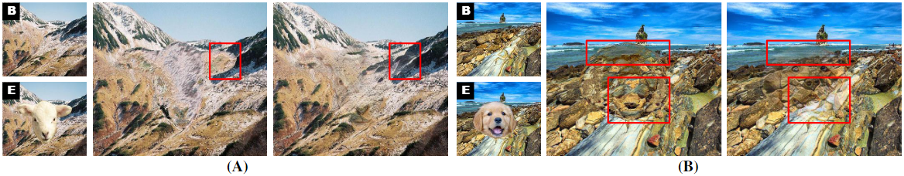
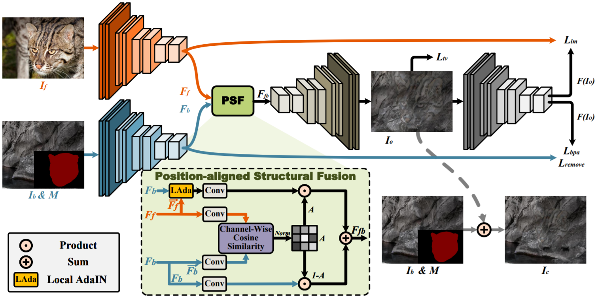
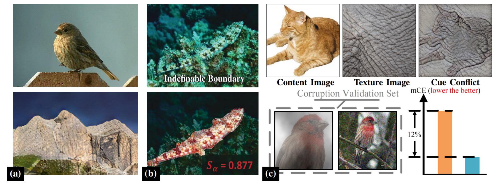
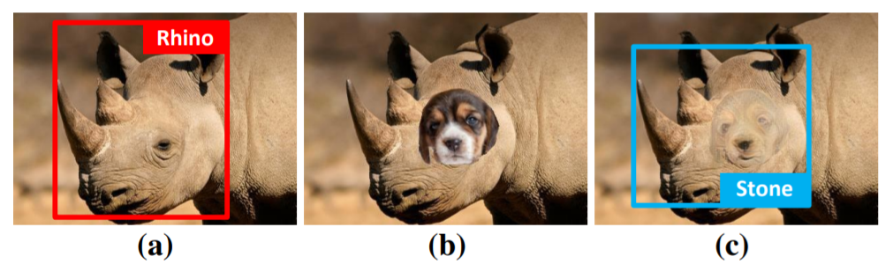
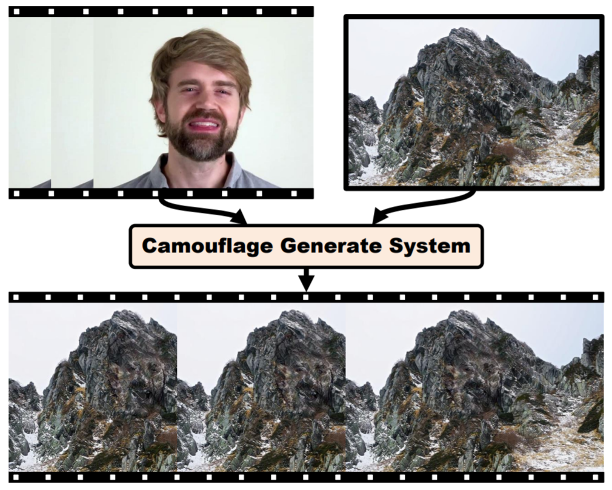

# Location-Free Camouflage Generation Network

Pytorch implementation of ''Location-Free Camouflage Generation Network''. 

## 📋 Table of content
 1. [📎 Paper Link](#1)
 2. [💡 Abstract](#2)
 3. [✨ Motivation](#3)
 4. [📖 Method](#4)
 6. [📃 Requirements](#5)
 7. [✏️ Usage](#6)
 8. [📊 Experimental Results](#7)
 9. [🍎 Potential Applications](#8)
 10. [✉️ Statement](#9)
 11. [🔍 Citation](#10)

## 📎 Paper Link <a name="1"></a> 
> Location-Free Camouflage Generation Network ([link](https://arxiv.org/pdf/xxxx.xxxxx.pdf))
* Authors: Yangyang Li*, Wei Zhai*, Yang Cao, Zheng-jun Zha
* Institution: University of Science and Technology of China (USTC)

## 💡 Abstract <a name="2"></a> 

Camouflage is a common visual phenomenon, which refers to hiding the foreground objects into the background images, making them briefly invisible to the human eye. Previous work has typically been implemented by an iterative optimization process. However, these methods struggle in 1) efficiently generating camouflage images using foreground and background with arbitrary structure; 2) camouflaging foreground objects to regions with multiple appearances (e.g. the junction of the vegetation and the mountains), which limit their practical application. To address these problems, this paper proposes a novel Locationfree Camouflage Generation Network (LCG-Net) that fuse highlevel features of foreground and background image, and generate result by one inference. Specifically, a Position-aligned Structure Fusion (PSF) module is devised to guide structure feature fusion based on the point-to-point structure similarity of foreground and background, and introduce local appearance features point-bypoint. To retain the necessary identifiable features, a new immerse loss is adopted under our pipeline, while a background patch appearance loss is utilized to ensure that the hidden objects look continuous and natural at regions with multiple appearances. Experiments show that our method has results as satisfactory as state-of-the-art in the single-appearance regions and are less likely to be completely invisible, but far exceed the quality of the state-of-the-art in the multi-appearance regions. Moreover, our method is hundreds of times faster than previous methods. Benefitting from the unique advantages of our method, we provide some downstream applications for camouflage generation, which show its potential.

## ✨ Motivation <a name="3"></a> 

<p align="center">
     <br />
    <em> 
    </em>
</p>

**Motivation.**  Comparison of SOTA method [13] and our results in regions with complex structures and multiple appearances. Part (A): Structural consistency.
Zhang et al. break the continuation of vegetation at the marked position, while we preserve this structure and are therefore more visually natural. Part (B):
Appearance consistency. Zhang et al. mixed multiple appearances of the camouflage region, making the foreground too standout, while we distinguish the
various appearances and achieve the purpose of camouflage.


## 📖 Method <a name="4"></a> 

<p align="center">
     <br />
    <em> 
    </em>
</p>

**Overview of Location-free Camouflage Generation Network (LCG-Net).** LCG-Net accepts foreground image If and background image Ib with the
same size. The encoder is taken from the first four layers of VGG-19 for extracting the high-level features. PSF module fuses the foreground and background
features and feeds the result into the decoder to generate an output image Io. We finally embed Io into Ib to get the refined result Ic. We use the same
structure as the Encoder E to calculate the loss functions. The specific structures of the encoder and decoder are given in the supplementary materials.
Position-aligned Structural Fusion (PSF) module. It adaptively fuses the high-level features of the foreground and background according to their point-to-point
structure similarity, and feeds the result to the decoder. Norm represents the normalization operation.

## 📃 Requirements <a name="5"></a> 
  - python 3
  - pytorch 
  - opencv 

## ✏️ Usage <a name="6"></a>
### Download models
Download [models](https://pan.baidu.com/s/1IIaX2CDG-rH2gLjAwhV2TA) (Password: wuj2) and put `decoder.pth`, `PSF.pth`,`vgg_normalised.pth` under `models/`.

### Test

We provide six sets of foreground and background images for users to observe the effect of camouflage generation. Use `--use_examples` to choose which set you want to generate (from 1 to 6 ). 

```
python test.py --use_examples 1
```

The generated result can be found at `output/x_x.jpg`. "x" is the number of your choice.

You can also generate camouflage images using foreground and background images of your own choice by `--fore`, `--mask` and `--back`. We need you to provide the mask image corresponding to the foreground object. The default camouflage region is the center of the background image.

```
python test.py --use_examples None --fore input/fore/2.jpg --mask input/mask/2.png --back input/back/2.jpg
```

Some other options for your own foreground an background images:

- `--zoomSize`: Scale the foreground object by a factor of "zoomSize".
- `--Vertical`: Shift the camouflage region down from the default position by "Vertical" pixels (can be negative but not beyond the image boundaries). 
- `--Horizontal`: Shift the camouflage region right from the default position by "Horizontal" pixels (can be negative but not beyond the image boundaries). 
- `--Top`: Crop the result, starting from the "Top" pixels in the vertical direction.
- `--Bottom`: Crop the result, end at the "Bottom" pixels in the vertical direction.
- `--Left`: Crop the result, starting from the "Left" pixels in the horizontal direction.
- `--Right`: Crop the result, end at the "Right" pixels in the horizontal direction.

### Train

Use `--fore_dir`, `--mask_dir` and `--back_dir` to provide respective directory  to the foreground, mask and background images. Each foreground image must have the same prefix as the corresponding mask image.

```
python train.py --fore_dir <fore_dir> --mask_dir <mask_dir> --back_dir <back_dir>
```

The foreground and background datasets we use are [MS-COCO](imags.cocodataset.org/zips/val2017.zip) with corresponding [annotation](imags.cocodataset.org/annotations/annotations_trainval2017.zip) and [Landscape](https://github.com/yuweiming70/Landscape-Dataset) (cull gray images) respectively, you can also try other datasets for training. 

## 📊 Experimental Results <a name="7"></a> 


<p align="center">
     <br />
    <em> 
    </em>
</p>

**Comparison with existing methods in single-appearance regions.** The top of the first column is the background image (B), the bottom is the embedding of the foreground (E), the second to sixth columns are the results generated by other methods, and the last column is the results generated by our method.

<p align="center">
     <br />
    <em> 
    </em>
</p>

**Comparison with existing methods in multi-appearance regions.** The top of the first column is the background image (B), the bottom is the embedding of the foreground (E), the second to sixth columns are the results generated by other methods, and the last column is the results generated by our method.

## 🍎 Potential Applications <a name="8"></a>

<p align="center">
     <br />
    <em> 
    </em>
</p>

**Camouflage Dataset.** Part (a) A standard example from ImageNet [55] and the camouflage example generated with it. We do not embed the foreground objects into the background images since these human visual artifacts have little impact on the deep neural network. Part (b) Concealed Object Detection (COD), the camouflage dataset can assist the training of COD. Part (c) Top: Transfering the style of elephant skin to the cat, Geirhos et al. [56] proves that traditional CNNs are strongly biased towards recognizing textures rather than shapes and classify the stylized result as “elephant”. Bottom: Introducing the camouflage dataset can force CNNs to avoid the features of short-cut and learn the essential features which have the discriminative ability, thereby reducing mean corruption error (mCE) on the corruption validation set.

<p align="center">
     <br />
    <em> 
    </em>
</p>

**Adversarial Attack.** (a) Original image, the detection result is "rhino". (b) Embedding the object to be camouflaged. (c) Adversarial Example, it still looks like a "rhino" to the human eye, while the detection result is "Stone".

<p align="center">
     <br />
    <em> 
    </em>
</p>

**Visual Effects.** Camouflage human (or animals) images to mountains (or other landscapes) to create some interesting results, or to use in film and television productions.

## ✉️ Statement <a name="9"></a> 
This project is for research purpose only, please contact us for the licence of commercial use. For any other questions please contact [lyy1030@mail.ustc.edu.cn](lyy1030@mail.ustc.edu.cn) or [wzhai056@mail.ustc.edu.cn](wzhai056@mail.ustc.edu.cn).

## 🔍 Citation <a name="10"></a> 

```
@inproceedings{Li2022Location,
  title={Location-Free Camouflage Generation Network},
  author={Yangyang Li and Wei Zhai and Yang Cao and Zheng-jun Zha},
  year={2022}
}
```
